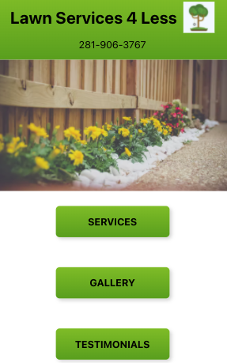
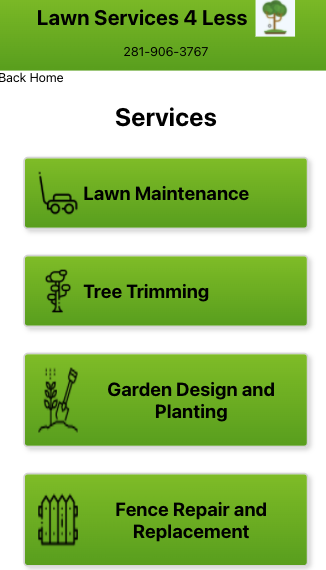
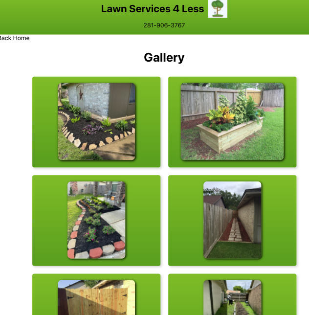
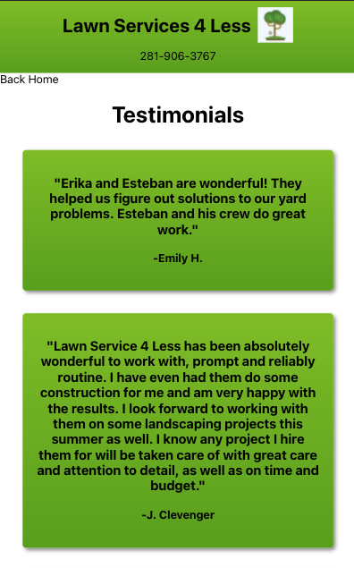
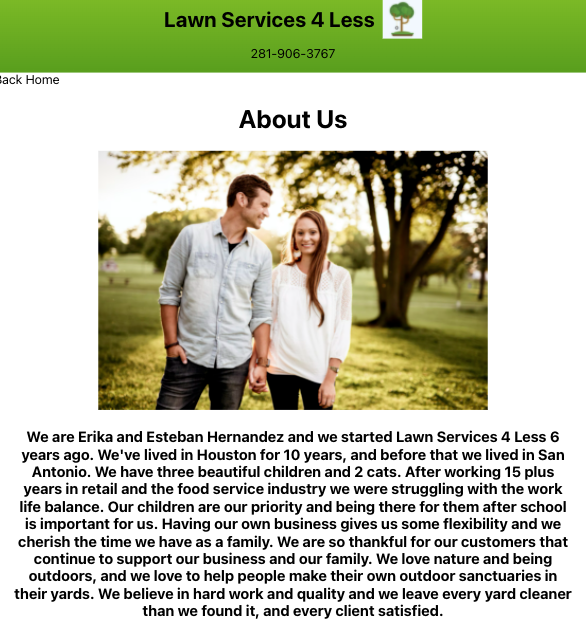
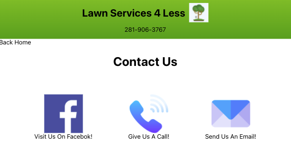

## About The Project

The homepage is clean and effective, and offers you 6 page options, and a Navbar with a clickable phone number to contact the business. The Navbar is present on every page.

The entire site is fully responsive, and built mobile first.

## Services Page
The services page shows you what services are offered, and utilizes icons made by Freepik, downloaded from [Flaticon](https://www.flaticon.com/). There is also a link to take you back to the homepage.

## Gallery Page
The gallery link takes you to a collection of images of the company’s work. As of writing this article, the gallery is static, and has no animations. I’d like to make the pictures clickable and transform to be full page.

## Testimonials Page
The testimonials page is a collection of reviews pulled from Google and passed through the redux store. I would like to put these into a database so you can add reviews from this site as well.

## About Us Page
The About Us page is a stock photo from [Unsplash](https://www.unsplash.com), and half real, half fabricated blurb about the business owners, that will be edited when I hand the site over to my neighbor.

## Contact Us Page
The Contact Us page has 3 clickable icons, also from flaticon.com, that take you to either Facebook.com, your email app, or your phone app.

On the last page I used the Open Weather API to give clients an idea of when they can next schedule service. I was unable to get the dates from this API, but plan to write a function that converts this weird format they use.
There’s more I want to add to this site, and will in the coming days, to make it the website that my neighbors deserve. This project helped sharpen my React/Redux skills, and has really pushed my creativity for building a site mobile first.